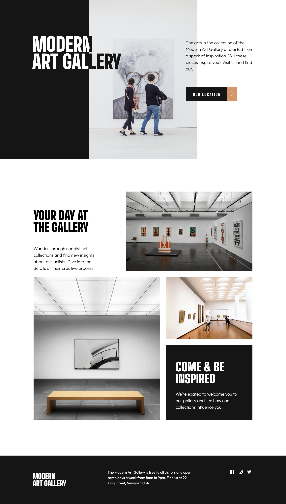
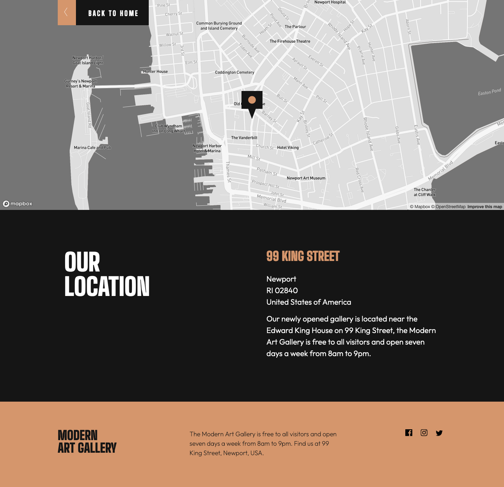

# Frontend Mentor - Art gallery website solution

This is a solution to the [Art gallery website challenge on Frontend Mentor](https://www.frontendmentor.io/challenges/art-gallery-website-yVdrZlxyA). Frontend Mentor challenges help you improve your coding skills by building realistic projects. 

## Table of contents

- [Frontend Mentor - Art gallery website solution](#frontend-mentor---art-gallery-website-solution)
  - [Table of contents](#table-of-contents)
  - [Overview](#overview)
    - [The challenge](#the-challenge)
    - [Screenshots](#screenshots)
    - [Built with](#built-with)
    - [What I learned](#what-i-learned)

## Overview

### The challenge

Users should be able to:

- View the optimal layout for each page depending on their device's screen size
- See hover states for all interactive elements throughout the site
- **Bonus**: Use [Leaflet JS](https://leafletjs.com/) to create an interactive location map with custom location pin

### Screenshots

### Built with

- Semantic HTML5 markup
- CSS custom properties
- Flexbox
- CSS Grid

### What I learned

- How to arrange images within a grid.
    -object-fit:contain 
      Image will overflow grid to preserve the aspect ratio of the image. When setting width or height, the remaining dimension will adjust to preserve original aspect ratio.

    -object-fit:cover
      The advantage of using cover is that it will seek to fill the grid space regardless of original dimensions.  This is udeful when you have an image smaller or larger than the grid box.
      The dimensions can be overridden by specifying the dimensions of the image.

    -Creating duel-colour text
      My solution was dependent of the width of the grid area. Will attempt a solution that will break free of those restraints in the future.

    -align-text property
      Doesn't just align horizontally, it aligns along the cross-axis. So if flexbox is set to row , then items will be aligned along the row but if set to column, it will align horizontally.

    -margin: 0 auto
      Behaviour - the element will take up the specified width then split equally the space between the left and right margins.

    -Mapbox
      My introduction to Mapbox and customised maps with Javascript.

